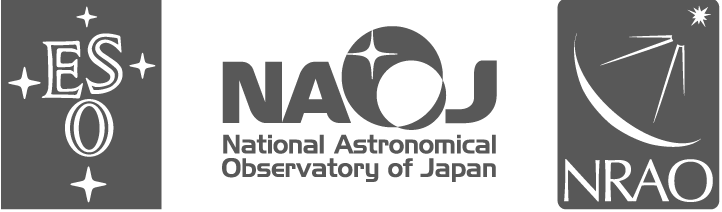
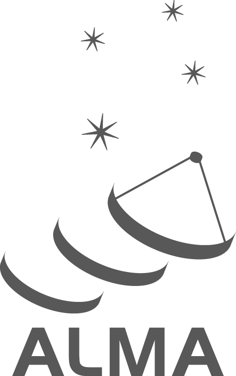

:::
#### User Support
:::
# ALMA Pipeline User's Guide




```{toctree}
:maxdepth: 1

alma-science-pipeline
quick-start
whats-new
pipeline-versions-and-documentation
data-processing-files
modifying-a-pipeline-run
helper-text-files
pipeline-weblog
hifa_polcalimage-recipe
hsd_calimage-recipe
weights
```
```

ALMA, an international astronomy facility, is a partnership of ESO (representing its member states),
NSF (USA) and NINS (Japan), together with NRC (Canada), NSC and ASIAA (Taiwan), and
KASI (Republic of Korea), in cooperation with the Republic of Chile. The Joint ALMA Observatory is
operated by ESO, AUI/NRAO and NAOJ.