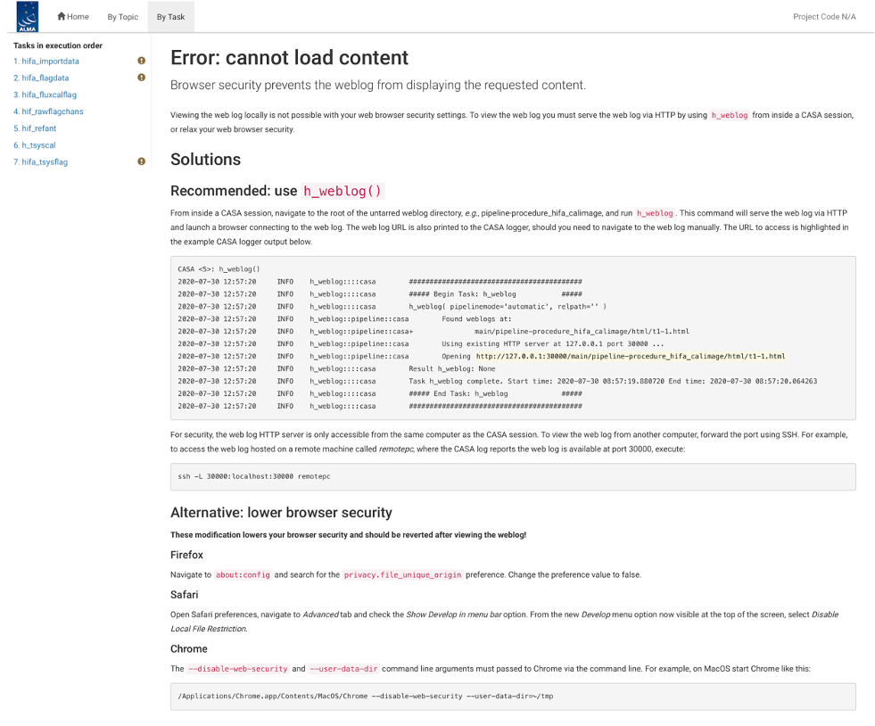
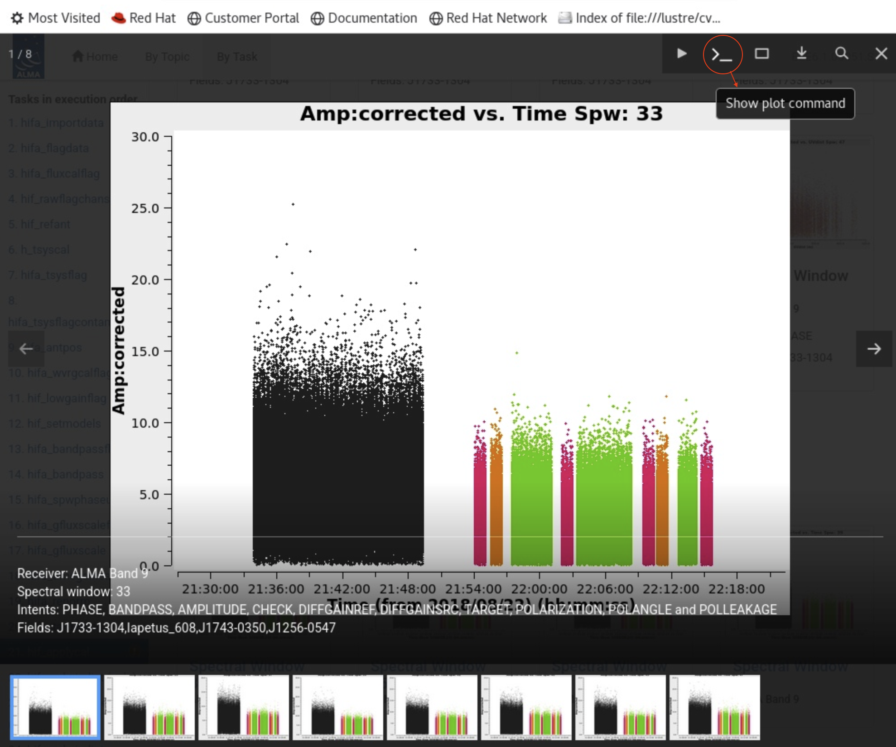
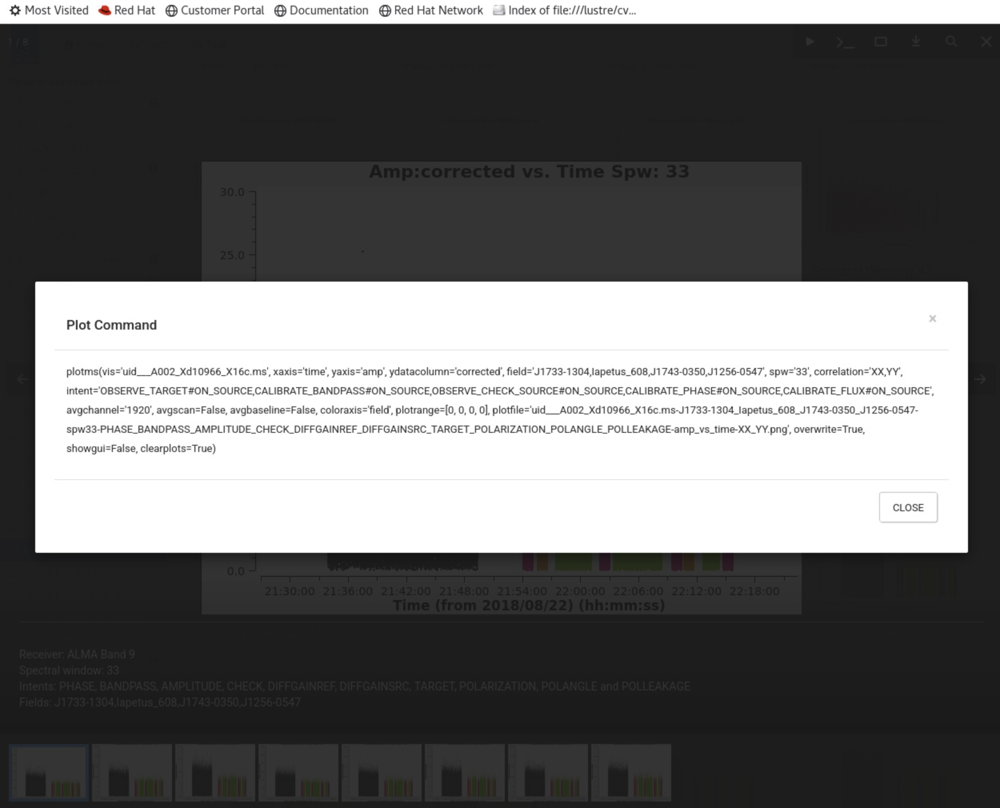
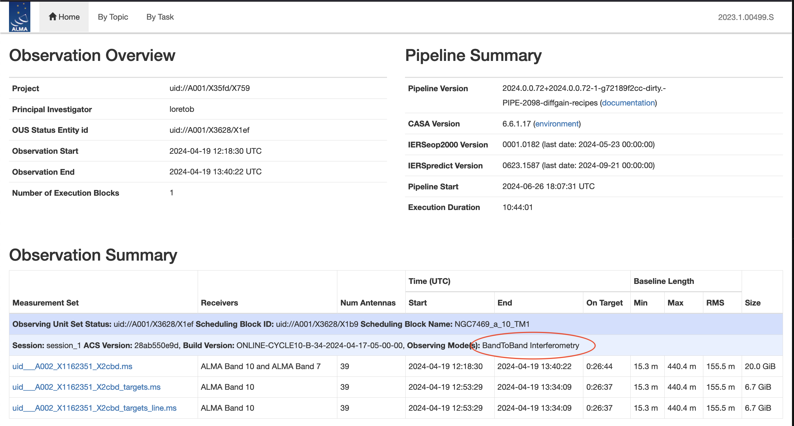
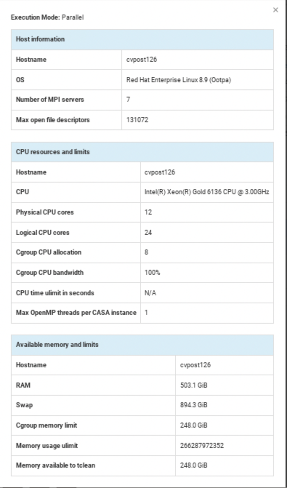
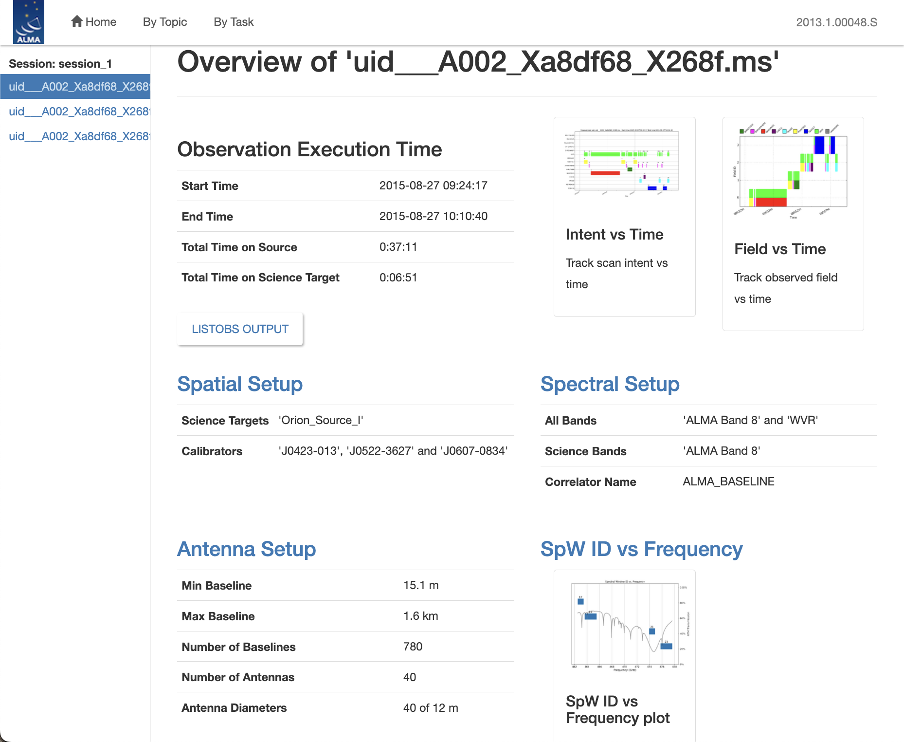
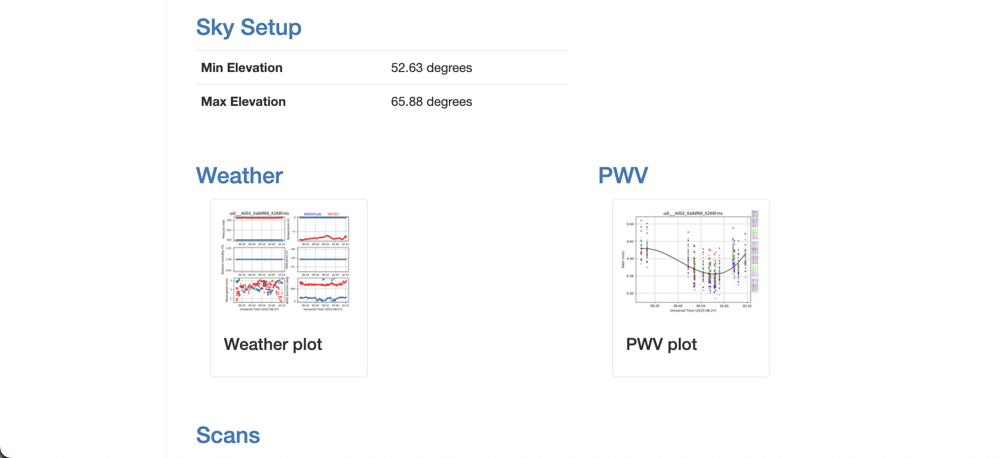
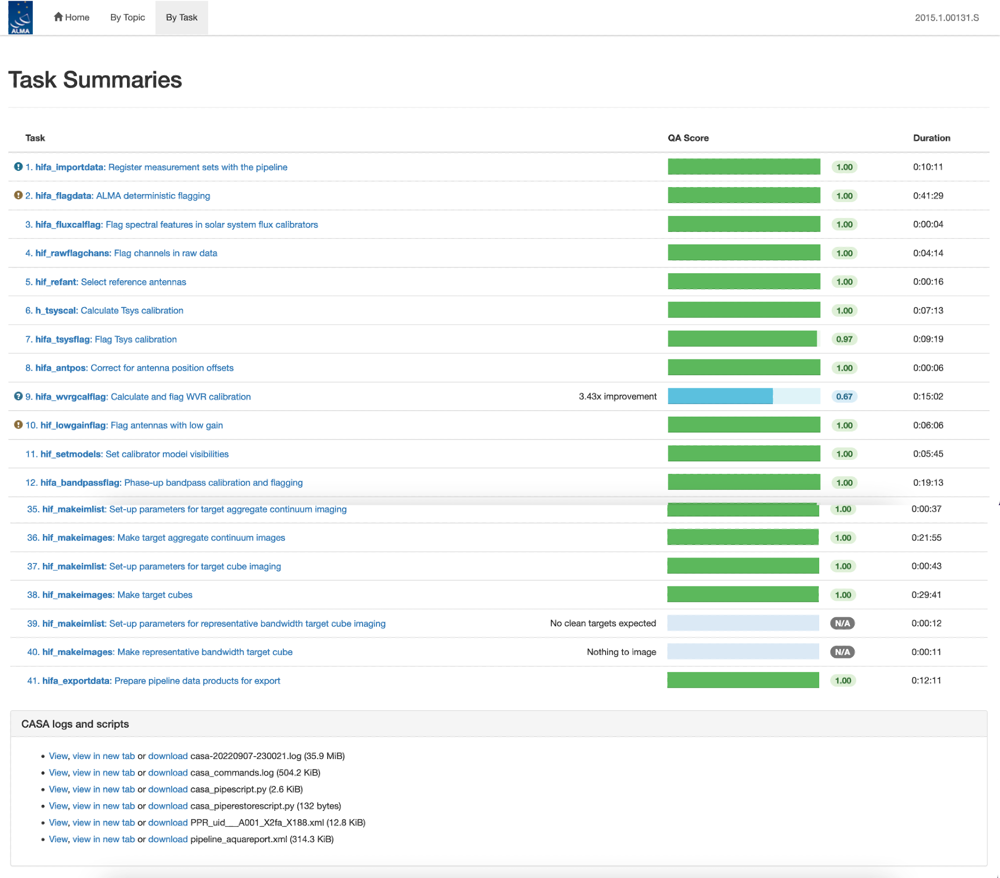
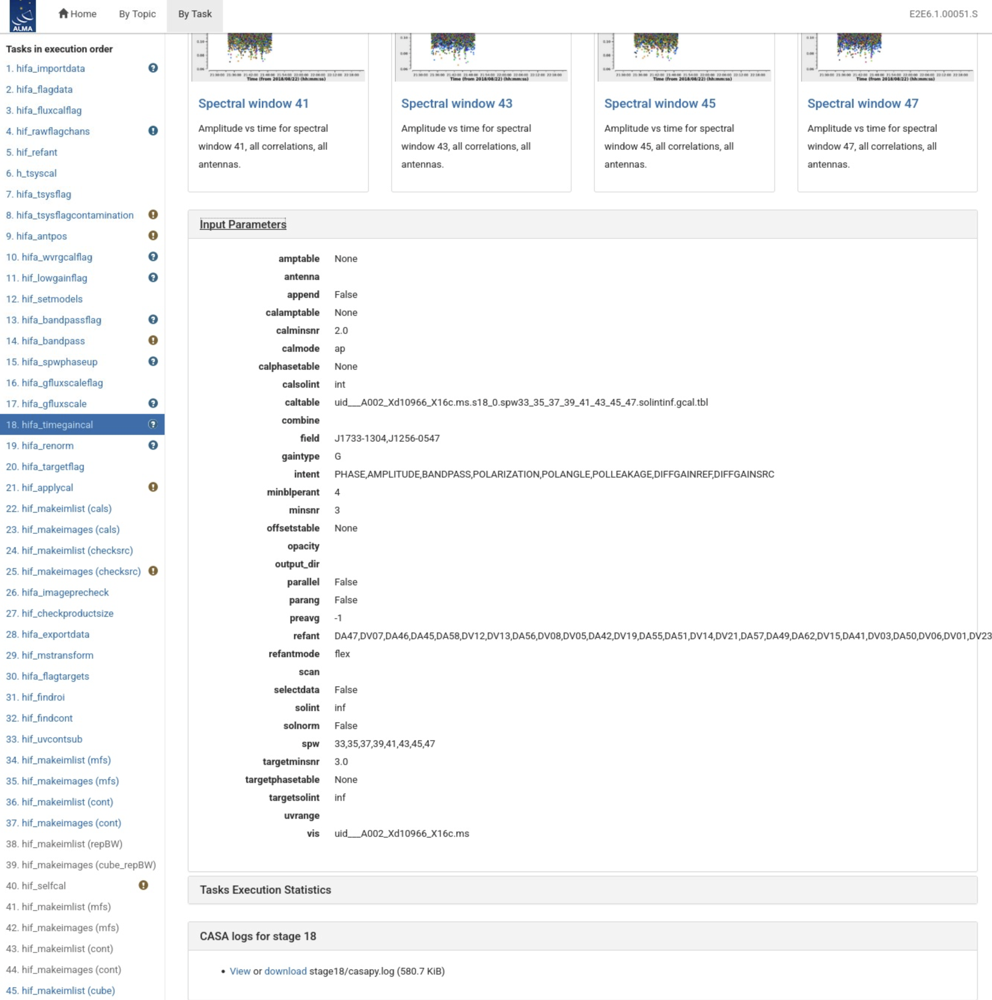
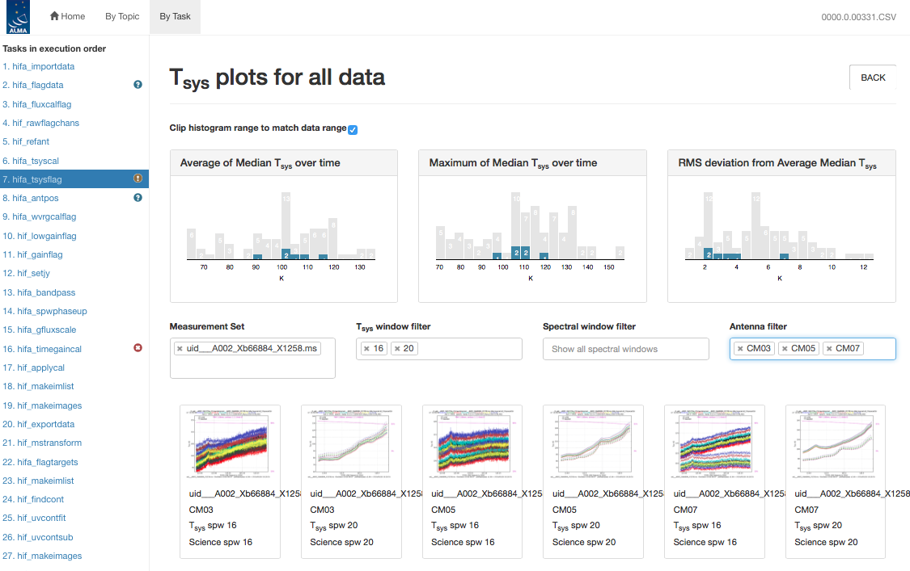

(sec-weblog)=
# The Pipeline WebLog

This section gives an overview of the Pipeline WebLog, which is a collection of webpages with diagnostic messages, tables, figures, and "Quality Assurance" (**QA**) scores. It is reviewed, along with the pipeline calibration and imaging products, as part of the ALMA Quality Assurance process, but also provides important information to investigators on how the pipeline calibration and imaging steps went through.

The section describes common elements to the single dish and interferometric Pipeline WebLogs. Subsequent sections present descriptions of the SD- or IF- specific "By Task" part of the WebLog.

## Overview

The WebLog is a set of html pages that give a summary of how the calibration of ALMA data proceeded, of the imaging products, and provides diagnostic plots and Quality Assurance (QA) scores. The WebLog will be in the **qa/** directory of an ALMA delivery. To view the WebLog, untar and unzip the file using e.g. `tar zxvf *weblog.tgz`. This will provide a **pipeline\*/html** directory containing the WebLog, which can be viewed using a web browser e.g. `firefox index.html`.

```{admonition} Note about browser security
:class: note

Most modern browsers now prevent javascript when using a file:// URL (e.g. viewing a WebLog on a local directory). The page shown below should appear, which describes the mitigation options. One can either use a localhost web server that is now delivered with CASA+Pipeline, or one can run a local http server with a command like `python3 -m http.server 8080 --bind 127.0.0.1`, or one can adjust the security settings in the browser by going to about:config and setting either `privacy.file_unique_origin` or `security.fileuri.strict_origin_policy` to False, whichever is available.
```

(fig-securitypage)=
**Browser security page**



The WebLog provides both an overview of datasets and details of the pipeline processing. Therefore many calibration pages of the WebLog will first give a single "representative" view, with further links to a more detailed view of all the plots associated with that calibration step. Some of these (those produced by the CASA tasks {func}`CASA/plotms <casaplotms.plotms>` and {func}`CASA/plotbandpass <casatasks.visualization.plotbandpass>`) will have a "Plot command" link that provides the CASA command to reproduce the plot (see the example below). When viewing image products, a similar link will provide the {func}`CASA/tclean <casatasks.imaging.tclean>` command that produced the image. For some stages, the detailed plots can be filtered by a combination of outlier, antenna and spectral window criteria. Where histograms are displayed, in modern web browsers it is possible to draw boxes on multiple histograms to select the plots associated with those data points. All pipeline stages are assigned a QA score to give an "at a glance" indication of any trouble points.

(fig-plotcommand)=
**Example WebLog "Plot command" link**




## Navigation

To navigate the main pages of the WebLog, click on items given in the bar at the top of the WebLog home page. Also use the **Back** button provided at the upper right on some of the WebLog sub-pages. Avoid using "back/previous page" on your web browser (although this can work on modern browsers). Throughout the WebLog, links are denoted by text written in blue and it is usually possible to click on thumbnail plots to enlarge them.

## Home Page

The first page in the WebLog gives an overview of the observations (proposal code, data codes, PI, observation start and end time), a pipeline execution summary (pipeline & CASA versions, link to the current pipeline documentation, pipeline run date and duration), and an **Observation Summary** table. Clicking on the "environment" link next to the CASA version will open a popup detailing hardware and software used; see the processing environment example below. Clicking on the bar at the top of the home page (see the example below) enables navigation to **By Topic** or **By Task**.
CASA relies on earth Geodetic information to determine the geometry of the array - this information is stored in the IERS Earth Orientation Parameters (eop2000, measured values), and IERS Predicted Earth orientation. Since it takes time to analyze measurements and update those in CASA, usually data processed within a month or two of the observation date uses the Predict table.

(fig-homepage)=
**WebLog Home Page**



(fig-processingenv)=
**Processing Environment popup window**



The **Observation Summary** table lists all the MeasurementSets included in the pipeline processing, grouped by observing "sessions". The Observing Mode (StandardInterferometry, StandardSingleDish, BandToBandInterferometry, etc.) is noted for the session.
Each MeasurementSet is calibrated independently by the pipeline. For data that have been run through the imaging stages of the pipeline, three MS will be listed — the original one including all data and spectral windows, a targets.ms containing only calibrated continuum+line science target data, and a targets_line.ms containing only calibrated continuum-subtracted science target line data. The table provides a quick overview of the ALMA receiver band used, the number of antennas, the start/end date and time, the time spent on source, the array minimum and maximum baseline length, the rms baseline length and the size of that MeasurementSet. To view the observational setup of each MeasurementSet in more detail, click on the name of it to go to its overview page.

### MeasurementSet Overview pages

Clicking on the MeasurementSet name in the **Observational Summary** table brings up the **MeasurementSet Overview page** (see the example below). Each MeasurementSet **Overview** page has a number of tables: **Observation Execution Time**, **Spatial Setup** (includes mosaic pointings), **Antenna Setup**, **Spectral Setup** and **Sky Setup** (includes elevation vs. time plot). For more information on the tables titled in blue text, click on these links. There are additionally links to **Weather, PWV, Scans**, **SpwID vs. frequency**, and **Telescope Pointings** (for the case of Single Dish observations) information. Two thumbnail plots, which can be enlarged by clicking on them, show the observation structure either as **Field Source Intent vs Time** or **Field Source ID vs Time**. To view the CASA listobs output from the observation, click on **Listobs Output**.

(fig-overviewpage)=
**MeasurementSet Overview Page**




## By Topic Summary Page

The **By Topic** summary page provides an overview of the lowest QA scores for tasks grouped by processing topic, followed by a listing of all "Error!" or "Warning!" level task notifications, and then a **Flagging Summaries** section which presents a graphic depicting the fraction of data flagged by antenna & spw for every calibrator and science target.

## By Task Summary Page

The **By Task** summary page (see the example below) gives a list of all the pipeline stages performed on the dataset. It is not displayed per MeasurementSet as the Pipeline performs each step on every MeasurementSet sequentially before proceeding to the next step; e.g. it will import and register all MeasurementSets with the Pipeline before proceeding to perform the ALMA deterministic flagging step on each MeasurementSet. The name of each step on the By Task page is a link to the corresponding Task Page which provides detailed information for the task as described below ({ref}`Task Pages <sec-taskpages>`).

On the right hand side of the page are colored bars and scores that indicate how well the Pipeline processing of that stage went. Green bars should indicate a fairly problem-free dataset, while other colors indicate less than perfect QA scores following the assessment described in {ref}`WebLog Quality Assessment (QA) Scoring <sec-qascores>`. Encircled symbols to the left of each task name (circled "?", circled "!", circled "X"), indicate that there are informative QA messages or important notifications on the task pages.
Stages with a circled "!" symbol next to them can indicate either poor QA scores (QA Score progress bar on the Task Summaries page will be yellow with a short descriptive text) or "Warning" notifications, which are important messages about the stage execution but which are not thought to indicate a quality issue with the data (i.e. the QA Score progress bar on the Task Summaries page may still be green, e.g. the {func}`hifa_tsysflag <pipeline.hifa.cli.hifa_tsysflag>` and {func}`hif_lowgainflag <pipeline.hif.cli.hif_lowgainflag>` stages in the example below).

(fig-bytaskpage)=
**By Task summary view**



### CASA logs and scripts

At the bottom of the **By Task** summary page are links to the CASA logs and supporting files and scripts. These include the complete CASA log file produced during the pipeline run, the pipeline restoration scripts described in {ref}`Archived scripts <sec-allscripts>`: `casa_pipescript.py` and `casa_piperestorescript.py`, and the `casa_commands.log` file described in {ref}`CASA equivalent commands file <sec-casacommandslog>`.

## Task Pages

(sec-taskpages)=
Each task has its own summary page that is accessed by clicking on the task name on the **By Task** summary page or in the left navigation menu from other pages. The task pages provide the outcome, or the representative outcome, of each Pipeline task executed. **For a fast assessment of the calibration results, go straight to the {func}`hif_applycal <pipeline.hif.cli.hif_applycal>` page (or {func}`hsd_applycal <pipeline.hsd.cli.hsd_applycal>` page for the case of single dish observations).** At the top of the page will be the **Pipeline QA** scores and associated messages and any **Task Notification** (see the example below). If there are more than one QA messages, the message corresponding to the lowest score will be displayed with a link to all QA scores and messages. Clicking this link will expand the QA score table to show all entries. Similarly, if there are more than one notifications, the most severe will be displayed along with a link to all notifications. These messages are color-coded by severity: green means the quality check were fine, blue are informative messages that should not impact the quality of the processing, and yellow and red indicate important notifications or that a QA heuristic was triggered (see {ref}`The Pipeline WebLog <sec-weblog>`).

(fig-hifa-tsysflag-page-example)=
**{func}`hifa_tsysflag <pipeline.hifa.cli.hifa_tsysflag>` task page**


At the bottom of each task page are expandable sections for **Input Parameters** and **Task Execution Statistics**, and links to the CASA log commands for the specific task. An example is given below.

(fig-hifa-timegaincal-showing-qa)=
**Bottom of the {func}`hifa_timegaincal <pipeline.hifa.cli.hifa_timegaincal>` page**



### Task sub-pages and plot filtering

Most sub-pages have further links in order to access a more detailed view of the outcome of each task. These links are often labelled by the MeasurementSet name. Some of these plots can be filtered by entering one or more MS, antenna, or spectral window in the appropriate box. Still others have histograms of various metrics than can be selected using the cursor in a drag-and-drop sense to outline a range of histogram values and displays the plots for the MS/antenna/spw combinations that are responsible for those histogram values. An example of these subpages and plot filtering is given below, using the **By Task > hifa_tsysflag: Flag Tsys calibration** pages.

(fig-filtertsysflag1)=
**Unfiltered {func}`hifa_tsysflag <pipeline.hifa.cli.hifa_tsysflag>` sub-page**


(fig-filtertsysflag2)=
**Filtered {func}`hifa_tsysflag <pipeline.hifa.cli.hifa_tsysflag>` sub-page**



(fig-filtertsysflag3)=
**Histogram-filtered {func}`hifa_tsysflag <pipeline.hifa.cli.hifa_tsysflag>` sub-page**


## WebLog Quality Assessment (QA) Scoring

(sec-qascores)=
Pipeline tasks have QA scores associated with them in order to quantify the quality of the dataset and the calibration. These scores are designed to inform data inspection as part of the ALMA quality assurance or "QA2" process. When there are multiple QA heuristics for a stage (each with its own QA score), or scores are calculated separately for each ASDM in an observation, the overall task QA score is taken as the lowest of all computed scores. Valid QA scores have values between 0.0 and 1.0 and are colorized according to the following table:

```{list-table}
:widths: 20 20 60
:header-rows: 1

* - Score ($S$)
  - Color
  - Meaning
* - $0.90 < S \leq 1.00$
  - <span style="color: #1a7a3c; font-weight: bold">Green</span>
  - No issues identified
* - $0.66 < S \leq 0.90$
  - <span style="color: #1a5fa8; font-weight: bold">Blue</span>
  - No serious issues identified, but a note has been added
* - $0.33 < S \leq 0.66$
  - <span style="color: #b8860b; font-weight: bold">Yellow</span>
  - QA warning triggered; carefully inspect the results for this stage
* - $0.00 \leq S \leq 0.33$
  - <span style="color: #c0392b; font-weight: bold">Red</span>
  - Serious issue; may not meet quality standards
```

The failure to calculate a QA score results in a <span style="color: #c0392b; font-weight: bold">red</span> score of -0.1. The individual QA scores and associated messages appear at the top of each task WebLog page. If there is more than one QA score and message, this section is expandable by clicking on the "All QA Scores" link (see the {func}`hifa_tsysflag <pipeline.hifa.cli.hifa_tsysflag>` task page example above).

A detailed description of the IF Pipeline QA scores and their motivation is given in Sec. 7 of [Hunter et al. 2023](https://ui.adsabs.harvard.edu/abs/2023PASP..135g4501H/abstract). Any changes to the scores since the date of that paper will be included in the by-task API pages here.
