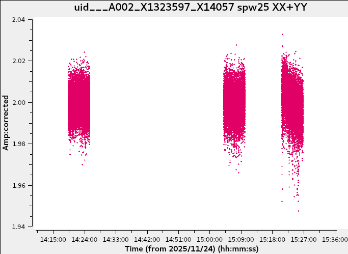
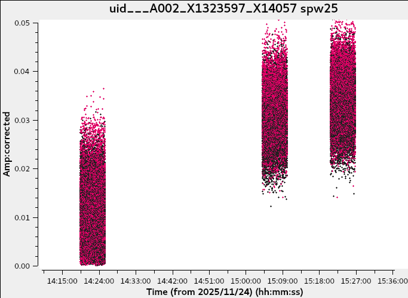

# What's New in Pipeline 2026.2.0

This document summarizes ALMA Pipeline development on the
[`PIPE/pipeline`](https://open-bitbucket.nrao.edu/projects/PIPE/repos/pipeline/browse)
repository between October 2025 and August 2026, targeting release
**2026.2.0**.

---

## Highlights

- **{func}`~pipeline.hif.cli.hif_findroi`: a new fast region-of-interest stage.** This new imaging
  stage identifies likely source regions ahead of continuum/line imaging using a fast
  algorithm developed under {jira}`PIPEREQ-414`, and has been integrated into the ALMA
  imaging recipes. See {ref}`IF imaging heuristics <hif_findroi>`.
- **Continuum-finding imaging refactored.**
  {func}`~pipeline.hif.cli.hif_findcont` now constructs its dirty-cube target
  list internally, removing the separate pre-findcont
  {func}`~pipeline.hif.cli.hif_makeimlist` stage from imaging recipes.
  Standard PL2026 ALMA recipes use a new coarse mode to reduce processing
  time, and the WebLog reports the effective continuum-finding imaging setup.
  See {ref}`IF imaging heuristics <findcontinuum>`.
- **QA-message aggregation rolled out across most SD stages** so that
  repeated warnings for the same metric/score collapse into a single
  accordion entry in the weblog, matching the IF weblog style — see
  {ref}`SD weblog/QA <sd-weblog-qa>`.
- **Low-SNR bandpass/gain heuristics extended** to {func}`~pipeline.hif.cli.hif_lowgainflag` and
  {func}`~pipeline.hifa.cli.hifa_wvrgcalflag`, reusing the `combine='spw'` + `interp='linearPD'`
  low-SNR machinery introduced for PL2025 — see
  {ref}`IF calibration heuristics <if-calibration>`.
- **Several QA-score thresholds were re-tuned** (percent-flagged,
  newly-flagged, check-source fit, RepBW mom8fc) based on an analysis of
  "slow lane" false positives, aiming to route more good data through the
  ALMA FastLane — see {ref}`IF weblog/QA <if-weblog-qa>`.
- **Single-dish imaging switches from `pseudoI` to true Stokes I**,
  simplifying the weight-handling pipeline — see
  {ref}`SD heuristics <sd-heuristics>`.
- **Documentation restructuring:** CLI docstrings extracted from the User
  Guide, a new getting-started guide, and a live dependency specification —
  see {ref}`Documentation <documentation>`.

---

(if-calibration)=

## IF calibration heuristic changes

*(not weblog or QA - see {ref}`IF weblog/QA <if-weblog-qa>` for score/plot changes
to these same tasks)*

**Source Catalog bailout.**
When {func}`~pipeline.hifa.cli.hifa_importdata` is called with `dbservices=True`,
if both test queries to the Source Catalog survey fail, the pipeline will halt (*{jira}`PIPE-2127`*).

**Low-SNR bandpass/gain heuristics extended to more stages.**
The `combine='spw'` + `interp='linearPD'` low-SNR bandpass/phase-up
heuristic developed for PL2025 was extended across more of the calibration
recipe:

- {func}`~pipeline.hif.cli.hif_lowgainflag` now reuses the ALMA phase-up bandpass code from {func}`~pipeline.hifa.cli.hifa_bandpass` (`hifa/tasks/bandpass/almaphcorbandpass.py`) instead of a generic worker.
- The `interp='linearPD'` rule was generalized to every stage that can trigger a `combine='spw'` solve for `BANDPASS`, `AMPLITUDE`, `CHECK`, and `PHASE` intents ({func}`~pipeline.hifa.cli.hifa_bandpassflag`, {func}`~pipeline.hifa.cli.hifa_bandpass`, {func}`~pipeline.hifa.cli.hifa_gfluxscale`, {func}`~pipeline.hifa.cli.hifa_diffgaincal`, {func}`~pipeline.hifa.cli.hifa_timegaincal`).
- {func}`~pipeline.hifa.cli.hifa_wvrgcalflag` gained the same per-SPW low-SNR fallback instead of failing when a gain table ends up fully flagged.

A regression introduced along the way — a phase-offset solve step dropped ahead of the new phase-up, which worsened flagging for a clear low-SNR case — was subsequently corrected.
*Tickets: {jira}`PIPE-2601`,
{jira}`PIPE-2858`,
{jira}`PIPE-3006`,
{jira}`PIPE-3139`.*

**SNR computation refactor.**
The effective number of antennas used in sensitivity scaling
was updated to use $N_{\text{ant}} - 3$ from VLA Memo 135 (Cornwell 1981),
i.e., solution noise is infinite for a 3-antenna array.
*Ticket: {jira}`PIPE-2901`.*

**Polarization calibration recipe fix.**
{jira}`PIPE-3016` unregisters the
first SPW-to-SPW phase-offset table after the initial round of the
polarization-calibration recipe, so the second
{func}`~pipeline.hifa.cli.hifa_bandpass` call (after
{func}`~pipeline.hifa.cli.hifa_lock_refant`) no longer pre-applies a now-stale table computed with a
possibly different reference antenna.

**Cross-pol examination for polarization/flux calibrators.**
{jira}`PIPE-2956` adds an
`examineCrossPolSum` parameter to
{func}`~pipeline.hifa.cli.hifa_polcalflag` and
{func}`~pipeline.hifa.cli.hifa_gfluxscaleflag` (via
`correctedampflag`) to control whether cross-polarization data are examined
for multi-scan calibrators — i.e., although XX+YY is flat in time, XY+YX is sometimes not:

```{list-table}
:header-rows: 1
:widths: 33 33 33

* - XX, YY
  - XX+YY
  - XY, YX
* - 
  - 
  - 
```

**Robustness fixes.**
{jira}`PIPE-2752` refines heuristics
across {func}`~pipeline.h.cli.h_tsyscal`, {func}`~pipeline.hif.cli.hif_applycal`, {func}`~pipeline.hifa.cli.hifa_gfluxscale`,
{func}`~pipeline.hifa.cli.hifa_gfluxscaleflag`, {func}`~pipeline.hifa.cli.hifa_importdata`, {func}`~pipeline.hifa.cli.hifa_spwphaseup` and
{func}`~pipeline.hifa.cli.hifa_timegaincal` that previously assumed a TARGET intent was always
present, improving support for calibration-only/calsurvey MS processing.
{jira}`PIPE-2694` fixes an undefined
QA score (`min() arg is an empty sequence`) in
{func}`~pipeline.hifa.cli.hifa_gfluxscale` for
band-to-band data without a CHECK intent.
{jira}`PIPE-2868` adds an opt-in
bypass mode so {func}`~pipeline.hifa.cli.hifa_antpos` can
continue (with a bad QA score and warnings) instead of crashing when the
antenna-position query fails.
{jira}`PIPE-2166` switches
{func}`~casatasks.information.visstat` to `doquantiles=False`
inside {func}`~pipeline.hifa.cli.hifa_polcal` for a runtime improvement, where the statistics used
allow it.
{func}`~pipeline.hifa.cli.hifa_diffgaincal` no longer
crashes or over-flags TARGET/CHECK solutions when one of the two
band-to-band offset scan groups ends up fully flagged.
*Tickets: {jira}`PIPE-2915`,
{jira}`PIPE-2932`.*

**Import/data-handling fixes.**
{jira}`PIPE-3002` fixes a
{func}`~pipeline.hifa.cli.hifa_importdata` weblog rendering failure when a polarization-calibrator
field selected for the parallactic-angle plot is present in one EB of a
session but not another.
{jira}`PIPE-3099` fixes an MPI race
condition where concurrent {func}`~pipeline.hifa.cli.hifa_importdata` worker processes could read a
partially-flushed `flux.csv`, corrupting the import.
{jira}`PIPE-3101` refactors the
Source-Catalog flux XML parser to be robust against schema changes rather
than relying on fixed field ordering.
{jira}`PIPE-2320` fixes the
{func}`~pipeline.hifa.cli.hifa_flagdata` FDM-SPW detection
heuristic to use `msmd.almaspws()` instead of a channel-count threshold that
misclassified some Cycle 10 4×4-bit-correlation SPWs as TDM.
{func}`~pipeline.hifa.cli.hifa_tsysflagcontamination`
crashes were fixed for two independent causes: a NaN-handling incompatibility
with newer scipy `savgol_filter` versions, and a regex that assumed
measurement set names always start with `uid`.
*Tickets: {jira}`PIPE-2947`,
{jira}`PIPE-3115`.*

**Performance.**
{jira}`PIPE-3085` reduces redundant
`ms.open()`/`ms.close()` calls in {func}`~pipeline.hifa.cli.hifa_fluxcalflag`'s frequency-frame
conversion and in {func}`~pipeline.hif.cli.hif_applycal` weblog rendering, which was reopening the
MS once per field × SPW × EB.

---

(if-imaging)=

## IF imaging heuristic changes

*(not weblog or QA)*

(hif_findroi)=
**{func}`~pipeline.hif.cli.hif_findroi`: an experimental region-of-interest stage.**

{func}`~pipeline.hif.cli.hif_findroi` is an experimental PL2026 stage that
provides a fast search for candidate spectral-line regions in ALMA science
target data. It records the results as auxiliary findROI resources in
`findroi_workdir` and produces a native stage-product pickle, ROI and
continuum-range DAT files, summary plots, and a tarball containing these
products. The result is registered in `context.findroi_resources` for
inspection and can be included in the auxiliary products by
`hifa_exportdata`. The weblog reports selected, successful, and failed
field/SPW combinations and includes summary and evidence plots. Standard PL2026
imaging and continuum-processing stages do not currently use these ROI results
automatically.

```{figure} whatsnew/weblogOverview.png
---
width: 900px
align: center
---
Example hif_findroi weblog summary and spectral ROI evidence view. The displayed ROI products are experimental and are not automatically consumed by standard downstream tasks in PL2026.
```

*Tickets: {jira}`PIPE-3149`,
{jira}`PIPE-3151`,
{jira}`PIPE-3150`,
{jira}`PIPE-3155`,
{jira}`PIPE-3162`,
{jira}`PIPE-3136`,
{jira}`PIPE-3191`.*

(lsrk-refactor)=
**Imaging-MS support in `hif_mstransform`.**
{func}`~pipeline.hif.cli.hif_mstransform` adds support for creating
LSRK-regridded ``*_imaging.ms`` and ``*_imaging_line.ms`` products and
registering the corresponding imaging data types. Standard PL2026 recipes
continue to create and use the existing ``*_targets.ms`` and
``*_targets_line.ms`` products for downstream imaging.

*Tickets: {jira}`PIPE-3003`,
{jira}`PIPE-3057`,
{jira}`PIPE-3053`,
{jira}`PIPE-2952`,
{jira}`PIPE-2955`.*

(findcontinuum)=
**Improvements to continuum finding.**
PL2026 changes how {func}`~pipeline.hif.cli.hif_findcont` plans its
continuum-finding dirty cubes and updates `findContinuum.py` to v9.6:

- {func}`~pipeline.hif.cli.hif_findcont` now constructs its continuum-finding
  target list internally using {func}`~pipeline.hif.cli.hif_makeimlist`
  planning logic. The separate pre-findcont `hif_makeimlist` stages were
  removed from the ALMA and VLA imaging recipes. In the ALMA recipes, the
  later `hif_makeimlist` stage remains after
  {func}`~pipeline.hif.cli.hif_uvcontsub` to plan the subsequent science
  imaging.
- The new `hm_mode` parameter controls the continuum-finding imaging setup.
  The task default is `'normal'`, which preserves the behavior prior to
  PL2026. Standard PL2026 ALMA recipes explicitly use `'coarse'`, which
  reduces the cost of the dirty cubes through coarser pixel sampling, a
  uv taper, a minimum image size, and lower-cost weighting settings.
- The WebLog now identifies the selected mode and reports the effective
  imaging parameters for each field and SPW.
- For VLA targets where the imaging heuristics set a `uvrange` to exclude the
  shortest baselines because of a strong short-baseline amplitude excess,
  `hif_findcont` now applies that selection to its continuum-finding dirty
  cubes. A `uvrange` supplied through `target_list` is likewise honored; these
  selections were previously dropped.
- A `field` parameter is now exposed for the AUDI/VUDI workflow.
- Two crashes on edge cases with very few baseline channels (`nanmedian`/`np.min` on an empty channel selection) were resolved.
- Automatic y-axis limits were adjusted so bright or maser lines do not leave excessive white space in the continuum-fit plot.
- A stray unclosed file handle was closed.

```{figure} whatsnew/page513.png
---
width: 1062px
align: center
---
Continuum-fit plot with improved y-axis limits for bright spectral lines.
```

*Tickets: {jira}`PIPE-2766`,
{jira}`PIPE-2617`,
{jira}`PIPE-3131`,
{jira}`PIPE-3209`,
{jira}`PIPE-3164`,
{jira}`PIPE-3159`,
{jira}`PIPE-3103`,
{jira}`PIPE-3107`,
{jira}`PIPE-850`,
{jira}`PIPE-3102`.*

**Selfcal fixes.**
{jira}`PIPE-2908` fixes
{func}`~pipeline.hif.cli.hif_selfcal` dropping all solutions
for mosaics with single-polarization data, caused by an interaction between
two earlier fixes.
A batch of related selfcal robustness fixes addressed:
failure on field names containing a slash; large temporary-image I/O in the
near-field SNR estimator that could pressure node memory under concurrent
selfcal workers; and excessive memory use in clean-mask island boundary
rendering for large images.
*Tickets: {jira}`PIPE-2929`,
{jira}`PIPE-2937`,
{jira}`PIPE-2982`.*
{jira}`PIPE-3147` removes an
outdated "mosaic is a new mode" QA message.
{jira}`PIPE-2866` corrects
`minbeamfrac` for ACA data to 0.1 (it had inherited 0.3 from upstream
`auto_selfcal`), allowing selfcal to succeed on a larger fraction of ACA datasets.
{jira}`PIPE-3025` removes a
serial-model-write workaround for a {func}`~casatasks.imaging.tclean` mosaic-gridder bug ({jira}`CAS-14386`)
now that CASA 6.6.5 has fixed it upstream.

**Other imaging fixes.**
A cluster of multi-EB and polarization-imaging issues in
{func}`~pipeline.hif.cli.hif_makeimages` were resolved:
check-source products from all EBs (not just the last) are now exported and
deduplicated, full-polarization imaging correctly reuses the
Stokes-I-derived clean mask and threshold, and the polarization repBW Stokes
IQUV image now inherits the repBW Stokes I mask and threshold.
*Tickets: {jira}`PIPE-3074`,
{jira}`PIPE-3096`,
{jira}`PIPE-3018`,
{jira}`PIPE-3128`.*

**{func}`~pipeline.hifa.cli.hifa_imageprecheck`: corrected aggregate sensitivity calculation.**
{jira}`PIPE-3090` fixes a numerical-correctness bug in the aggregate
continuum sensitivity calculation. For some datasets, representative-target
field metadata could cause the same virtual science SPW to appear more than
once, particularly when the representative target had observations with both
`TARGET` and `ATMOSPHERE` intents. The sensitivity calculation treated
repeated entries as independent contributions, producing an artificially low,
over-optimistic sensitivity estimate. The corrected implementation uses a
unique list of `TARGET`-intent virtual SPWs.

**Spectral window filtering in image cube mitigation.**
{jira}`PIPE-3127` extends the {func}`~pipeline.hif.cli.hif_checkproductsize`
mitigation logic with a spectral-window filtering assessment triggered
as part of the max-cube-size/limit and max-product-size steps. This ensures that oversized data can still be partially imaged (including
only a subset of SPWs) instead of failing mitigation outright due to the largest cube.
A bug where single-SPW fields were unintentionally dropped was also resolved ({jira}`PIPE-2812`).

```{figure} whatsnew/PL2026_size_mitigation_flowchart_final.png
---
width: 1062px
align: center
---
Flowchart of the PL2026 image cube size mitigation procedure including spectral window filtering.
```

{jira}`PIPE-2909` allows cube imaging to
continue with a truncated channel grid instead of failing when a
user-specified frequency grid extends beyond the SPW coverage.
{jira}`PIPE-3157` fixes a blank
flat-noise image min/max in the weblog for VLASS workflows, a regression
from the pbcor/non-pbcor separation in PIPE-2073.

---

(sd-heuristics)=

## SD heuristic changes

*(not weblog or QA)*

**Imaging: migration to true Stokes I.**
{func}`~pipeline.hsd.cli.hsd_imaging` now images with
`stokes="I"` instead of the previous `stokes="pseudoI"` workaround, now that
a CASA-side behavior change ({jira}`CAS-9957`/{jira}`CAS-14444`) makes the two equivalent.
That migration in turn let the `WeightMS` subtask's weight-column
manipulation be skipped entirely, since it produces values consistent with
what {func}`~casatasks.single.sdbaseline` already sets -
improving imaging performance.
*Tickets: {jira}`PIPE-2490`,
{jira}`PIPE-2671`,
{jira}`PIPE-2491`.*

**Skycal / atmospheric-correction fixes.**
{jira}`PIPE-3198` fixes the
Elevation Difference vs. Time plot showing flagged data points that should
have been excluded.
{jira}`PIPE-3199` skips QA evaluation
instead of crashing (`zero-size array to reduction operation maximum`) when
a metric has no valid values.
{jira}`PIPE-2945` stops
{func}`~pipeline.hsd.cli.hsd_skycal` from crashing the whole run
when it fails to generate a sky caltable for just one of several science
targets — it now flags the affected rows and continues processing the rest
(with a secondary fix to how the AQUA report reflects the affected metric).
{jira}`PIPE-2774` revisits the
`atmtype` selection algorithm in
{func}`~pipeline.hsd.cli.hsd_atmcor` after PL2025 was found to
sometimes choose a worse type than PL2024.
{jira}`PIPE-1781` enables Tier-0
(MPI) parallelization for {func}`~pipeline.hsd.cli.hsd_atmcor`, now that OpenMP threading in the underlying
CASA task {func}`~casatasks.single.sdatmcor` has been confirmed not to conflict with `mpicasa`.
{jira}`PIPE-3167` fixes an old
absolute-off-position naming convention (`Target_0`) being misread as both
an off position and an independent target source.

**Jy/K calibration.**
{jira}`PIPE-2967` allows
{func}`~pipeline.hsd.cli.hsd_k2jycal` to fall back to a backup
URL (JAO, then EA/NA/EU) if the primary Jy/K database query fails, via
the new CASA task ({jira}`CAS-14704`).
{jira}`PIPE-3146` fixes the weblog
incorrectly reporting a successful Jy/K database access when
`dbservice=False`.

**Baseline-fitting heuristics.**
{jira}`PIPE-2695` fixes
{func}`~pipeline.hsd.cli.hsd_baseline` crashing when k-means clustering is attempted with fewer
line detections than requested clusters.
{jira}`PIPE-2893` adds a `sinusoid`
fitting-function option to
{func}`~pipeline.hsd.cli.hsd_baseline`, with a new
`wavenumber` parameter (list/per-SPW/per-EB inputs supported).

**Framework / cross-cutting SD fixes.**
{jira}`PIPE-2913` fixes the handling of
pointing distributions that straddle RA=12h by using `numpy.unwrap`
(CASA's measures tool wraps RA to ±180°, which previously could split a raster map into two disjoint chunks).
{jira}`PIPE-3035` fixes Tier-0
parallel parameter distribution for SD tasks, which assumed the scope
attribute was always `vis` instead of `infiles`.
{jira}`PIPE-2718` is a refactor of
{func}`~pipeline.hsd.cli.hsd_applycal` display/QA code for filename consistency and simplification.
{jira}`PIPE-2754` fixes a trivial
selected-table-object bug causing inconsistent ATM-cal data.
{jira}`PIPE-2954` fixes a typo
("futher" → "further") in a warning message.
{jira}`PIPE-3119` combines pointing
data across all antennas for the pointing-outlier heuristic, so a single
bad antenna's valid data isn't misclassified as outliers when compared only
against itself.

---

(if-weblog-qa)=

## IF weblog and QA changes

**Environment / landing page.**
{jira}`PIPE-2644` adds Python and
third-party library version info (and optionally GPU hardware specs) to the
weblog's environment splash page, so this no longer requires digging
through the CASA log.

**Per-MS overview / Spectral Setup Details.**
{jira}`PIPE-117` adds Resolution
columns (MHz and km/s) to the Spectral Setup Details table, alongside the
existing channel-width columns.
{jira}`PIPE-3095` fixes the
Correlation Bits column incorrectly showing `BITS_4x4` for old ALMA data
where that value is not actually known (CASA's `msmd.corrbit()` correctly
reports `UNKNOWN`, but the pipeline wasn't passing that through).

**Per-MS overview / Sky Setup.**
{jira}`PIPE-2472` adds the zenith angle and MJD of the observation.

**{func}`~pipeline.hifa.cli.hifa_importdata` Intent Separation Angles.**
{jira}`PIPE-65` adds a table and plot to the weblog to display the separation angles
between TARGET and PHASE, and between PHASE and CHECK intents. If there are >5 targets,
the table reports only the closest and most distant from the PHASE calibrator. For mosaics,
a median field position is used, while the source name is suffixed with "mosaic".
A large plus symbol represents each intent, with field IDs annotated.

```{figure} whatsnew/PIPE65_importdata_PL2026_new.png
---
width: 1062px
align: center
---
Weblog display of intent separation angles between targets and phase/check calibrators.
```

**{func}`~pipeline.hifa.cli.hifa_flagdata` / {func}`~pipeline.hif.cli.hif_applycal` QA-score re-tuning.**
{jira}`PIPE-3036` and
{jira}`PIPE-3037` shift the
"percent flagged" QA score for
{func}`~pipeline.hifa.cli.hifa_flagdata` and the
"newly flagged" score for
{func}`~pipeline.hif.cli.hif_applycal` upward, based on an
analysis ({jira}`PIPEREQ-399` item 3) showing the old thresholds were flagging too
many good datasets yellow instead of blue, keeping more data eligible for
ALMA FastLane without increasing the volume of poor-quality data delivered to PIs.
{jira}`PIPE-2716` adds the
calibration intent to `applycalQA_outliers.txt` so outlying data points can
be traced back to their scan/intent.

**{func}`~pipeline.hifa.cli.hifa_wvrgcalflag`.**
{jira}`PIPE-1868` changes the
WVRGCALFLAG score for ACA data with insufficient PM antennas from red to
yellow — a single flagged PM antenna could previously trigger a red score
meant for 12m-array failures.
{jira}`PIPE-1316` fixes two ordering
issues in the {func}`~pipeline.hifa.cli.hifa_wvrgcalflag` weblog table and plots (intent/field
ordering that changed between CASA versions, and inconsistent per-antenna
ordering) — this shares root-cause work with the PIPE-901
deterministic-ordering initiative (see {ref}`Infrastructure <infrastructure>`).

**{func}`~pipeline.hifa.cli.hifa_bandpass` / {func}`~pipeline.hifa.cli.hifa_gfluxscale`.**
{jira}`PIPE-2845` is a set of
follow-ups to the PIPE-2103 subband QA work: per-SPW (not per-SPW-per-antenna)
log messages, amp/phase-separated QA-message aggregation, and skipping PNG
plot creation by default.
{jira}`PIPE-2553` adds a QA metric to
{func}`~pipeline.hifa.cli.hifa_gfluxscale` that flags large
amplitude-vs-time variation for the flux calibrator as a possible QA0
SemiPass candidate.

**{func}`~pipeline.hifa.cli.hifa_timegaincal`.**
{jira}`PIPE-3026`, {jira}`PIPE-3028` update the phase-offset QA score so that phase offsets for SPWs that are not mapped receive a score of 0.75 (blue) instead of 0.50 (yellow), since such offsets should calibrate out.

**{func}`~pipeline.hif.cli.hif_makeimages` (repBW).**
{jira}`PIPE-3082` updates the RepBW
cube QA so the `mom8fc` subscore does not trigger a yellow warning score.

**{func}`~pipeline.hif.cli.hif_makeimages` (check source).**
{jira}`PIPE-3042` changes the check source fitting QA to consider only the positional offset and peak-to-integrated flux subscores.

**Determinism / ordering.**
{jira}`PIPE-888` replaces `list(set(...))`
with a deterministic `utils.deduplicate()` in flagging-command construction
across {func}`~pipeline.hif.cli.hif_lowgainflag`, {func}`~pipeline.hif.cli.hif_rawflagchans` and {func}`~pipeline.hifa.cli.hifa_tsysflag`, so
`casa_commands.log` no longer differs in flag-statement order between
identical runs at different ARCs.
{jira}`PIPE-3089` fixes caltable
filenames that could differ between serial and parallel execution for some
ALMA calibration tasks, since the parallel-worker filename template wasn't
consistently using the registered task name.
{jira}`PIPE-2698` and
{jira}`PIPE-2869` fix the Tsys
scan plot: the pipeline no longer attempts (and fails) to plot
`ON_SOURCE`/`TEST` intents for pre-Cycle-3 data (where they did not exist yet), and a non-deterministic
offset-position calculation that made the plot change between identical
reruns is now fixed.

---

(aqua)=

### AQUA report

{jira}`PIPE-2470` adds ASDM/EB UIDs
to the Project Structure section of `pipeline_aquareport.xml`, to support
the proposed per-EB Fast Feedback calibration workflow.
{jira}`PIPE-2489` fixes image names
in the AQUA report's `<Sensitivity>` entries to include the multiterm
extension instead of just the base name.

```{figure} whatsnew/Screenshot_2026-07-10_at_9.43.58_AM.png
---
width: 938px
align: center
---
AQUA report displaying multiterm image sensitivity entries.
```

{jira}`PIPE-3014` extends the AQUA
report's imaging statistics to cover Stokes Q, U and V target images for
polarization-calibration runs, not just Stokes I.
{jira}`PIPE-65` adds the phase/target/check-source
great-circle separation angles, as values and a plot, to both the weblog
and the AQUA report.
{jira}`PIPE-3034` fixes an AQUA
report formatting error where a single-string `vis`/ASDM description in the
`DataSelection` block was being comma-split character-by-character for
non-full-polarization recipes.
{jira}`PIPE-2073` adds the
non-primary-beam-corrected image peak flux to the AQUA report alongside the
existing PB-corrected value, useful for evaluating self-calibration.

---

(sd-weblog-qa)=

## SD weblog and QA changes

Organized by weblog stage/page, following the
[`hsd_calimage` recipe](https://pipe-docs.readthedocs.io/en/docs-update-pl2026/users_guide/hsd_calimage-recipe.html)
order.

**QA-message aggregation, rolled out stage by stage.** Repeated QA messages from the same metric/score are now aggregated into a
single accordion entry (matching the existing IF weblog style). This was applied in turn to
{func}`~pipeline.hsd.cli.hsd_applycal`
({jira}`PIPE-3055`),
{func}`~pipeline.hsd.cli.hsd_baseline`
({jira}`PIPE-3054`),
{func}`~pipeline.hsd.cli.hsd_imaging`
({jira}`PIPE-3104`),
{func}`~pipeline.hsd.cli.hsd_skycal`
({jira}`PIPE-3152`), and finally
{func}`~pipeline.hsd.cli.hsd_k2jycal`, {func}`~pipeline.hsd.cli.hsd_atmcor` and {func}`~pipeline.hsd.cli.hsd_blflag` together
({jira}`PIPE-3143`).

```{figure} whatsnew/m100_stage7_accordion.png
---
width: 938px
align: center
---
Example of QA-message aggregation into a single accordion entry in the single-dish weblog.
```

{jira}`PIPE-3161` improves the
{func}`~pipeline.hsd.cli.hsd_baseline` QA messages to report the virtual SPW (not the real,
per-MS SPW) for line-detection scores, avoiding confusing MS-specific
numbering in multi-MS runs.

```{figure} whatsnew/dev_virtual_spw_stage11.png
---
width: 800px
align: center
---
Display of virtual SPW numbering in hsd_baseline line-detection QA scores.
```

A bug preventing wide/edge line QA from triggering was fixed, and the representative line
width used for clustering was switched to the 75th percentile of the
detected cluster rather than the central value (which previously underestimated line width).
*Tickets: {jira}`PIPE-2959`,
{jira}`PIPE-2964`.*

**QA scoring and message ordering.**
{jira}`PIPE-2958` adds a new QA score
based on the ratio of observed to theoretical image RMS at the
{func}`~pipeline.hsd.cli.hsd_imaging` stage.
{jira}`PIPE-2988` sorts weblog QA
messages within the same color band by score, so the lowest score in each
band is easy to spot (a PLWG request from {jira}`PIPEREQ-424`).

**{func}`~pipeline.hsd.cli.hsd_applycal` weblog.**
{jira}`PIPE-2857` fixes a
randomly changing colormap in the XX-YY difference plot.

**{func}`~pipeline.hsd.cli.hsd_baseline` weblog.**
{jira}`PIPE-2867` fixes a
"spectral"/"spectra" typo in the averaged-spectrum caption.
{jira}`PIPE-2776` cleans up
double/missing periods and inconsistent punctuation in {func}`~pipeline.hsd.cli.hsd_baseline`'s "By
Topic" QA messages, aligning the style with the IF weblog.
{jira}`PIPE-2894` adds a channel axis
to the top panel of the sparse profile map (already done in the Nobeyama
Pipeline).

**{func}`~pipeline.hsd.cli.hsd_imaging` weblog.**
{jira}`PIPE-3047` adds an
explanatory caption to the missed-line-channel diagnostic plots at the
{func}`~pipeline.hsd.cli.hsd_imaging` stage, describing the
single-peak/extended detection thresholds and the plot's color coding.
{jira}`PIPE-3141` fixes an inverted
channel range for the {func}`~pipeline.hsd.cli.hsd_imaging` moment-map plot in LSB data.
{jira}`PIPE-3226` fixes an issue where atmospheric features were not properly excluded
from the contamination analysis.

**{func}`~pipeline.hsd.cli.hsd_skycal` weblog.**
{jira}`PIPE-2565` fixes the
"Show plot command" feature for Amp-vs-Time plots, which only showed the
last of several `plotms` calls used to build a multi-field overplot.

**Tsys scan plot (shared page).**
{jira}`PIPE-2869` - see
{ref}`IF weblog/QA <if-weblog-qa>` above; this fix applies to the same
`TsysScansChart` shared by both recipes.

**Imaging QA / diagnostics.**
False-positive QA warnings for contamination diagnostic plots were reduced
by excluding edge channels and ATM-line-overlapping channels from the
metric; the same technique was then applied to the missed-line-channel
diagnostic plots.
*Tickets: {jira}`PIPE-2946`,
{jira}`PIPE-3092`.*
{jira}`PIPE-3160` and
{jira}`PIPE-3109` fix `IndexError`
crashes when generating the channel-map and missed-line diagnostic plots when a
clustering-derived line range extends outside the valid channel bounds.
{jira}`PIPE-2183` and {jira}`PIPE-2399` fix inconsistent
display of flagged data at the {func}`~pipeline.hsd.cli.hsd_blflag` stage — flagged points above
the threshold line were sometimes rendered as unflagged.
{jira}`PIPE-3194` fixes a recurrence
of a previously fixed ({jira}`PIPE-2789`) bug where some panels of the
{func}`~pipeline.hsd.cli.hsd_applycal` XX-YY amplitude-difference-vs-frequency plot were empty.
{jira}`PIPE-2920` fixes the pointing-outlier log message, which previously reported separation
in arcseconds instead of degrees (inconsistent with the QA score message).

**AQUA report.**
{jira}`PIPE-3138` fixes the AQUA
report containing sensitivity estimates for more than one
`IsRepresentative = True` target (the representative source should be
unique per MOUS), resolving an SD-specific bug in how the
representative source was selected. See also the general-purpose AQUA-report changes in
{ref}`IF weblog/QA - AQUA report <aqua>`, which apply to both recipes.

---

(documentation)=

## Documentation

Tracked under the **Documentation PL2026** epic
({jira}`PIPE-2738`).

{jira}`PIPE-2890` extracts Pipeline
task subsections from the User Guide into each task's CLI docstring
(AI-assisted first pass, manual cleanup, PLWG review), part of a broader
restructuring and Sphinx/Read the Docs theme migration.
{jira}`PIPE-2897` adds a
getting-started guide and high-level architectural overview to the
Read the Docs pipeline documentation.
{jira}`PIPE-3190` is the tracking
ticket for the full 2026 User Guide review (quickstart, what's-new,
versions, data-processing files, `casa_pipescript`, helper files, weblog
overview, IF/SD task pages).
{jira}`PIPE-1682` adds a live pipeline dependency specification (`requirements.txt` / `pyproject.toml`)
to the codebase, maintained as part of the normal PR review process.
{jira}`PIPE-2152` clarifies what the
`parallel` argument actually does across different task CLI docstrings
(tier-1 CASA/imager parallelization vs. {func}`~casatasks.imaging.tclean`(parallel=True) vs. Tier-0
task-level parallelization), which had been inconsistently documented.
{jira}`PIPE-2870` fixes two wrong CLI
argument names surfaced during documentation review:
`hm_resolvecals` → `hm_resolvedcals` in
{func}`~pipeline.hifa.cli.hifa_gfluxscale`, and
`linesfiles` → `linesfile` in
{func}`~pipeline.hifa.cli.hifa_fluxcalflag`.

---

(infrastructure)=

## Infrastructure and performance

Tracked under the **Refactor/Infra PL2026**
({jira}`PIPE-2736`),
**Improve Pipeline performance for PL2026**
({jira}`PIPE-2735`) and
**Improve Pipeline testing for PL2026**
({jira}`PIPE-2737`) epics, plus the
**Resolve unpredictable ordering in various areas of the Pipeline**
initiative ({jira}`PIPE-901`).

**Determinism ({jira}`PIPE-901`).**
Beyond the weblog-visible fixes already covered in the weblog/QA sections
({jira}`PIPE-888`, {jira}`PIPE-1316`, {jira}`PIPE-3089`), this initiative underlies several changes
to make repeated pipeline runs on identical inputs produce identical
outputs.
{jira}`PIPE-2274` stops a second,
end-of-imaging call to
{func}`~pipeline.hifa.cli.hifa_exportdata` from attempting
to overwrite the same `Pipeline_Final` flag-version name used by the
first, end-of-calibration call ({func}`~casatasks.flagging.flagmanager` behavior otherwise
timestamp-renames the earlier one, sometimes within seconds).

**Timing/performance instrumentation.**
{jira}`PIPE-2014` improves the
timing statistics recorded in `timetracker.json` and the weblog — the
previous "Execution Duration" on the OUS splash page undercounted because
that page renders before weblog-rendering time is included.

**Compatibility / dependency maintenance.**
{jira}`PIPE-3116` fixes an
`AttributeError` in a Matplotlib `_SentinelMap` helper surfaced by
Matplotlib 3.11+.
{jira}`PIPE-2665` replaces
deprecated single-element-array-to-scalar NumPy conversions, and
{jira}`PIPE-2664` replaces the
deprecated `np.in1d` with `np.isin`.
{jira}`PIPE-2209` replaces a call to
the deprecated `AntennaArray.baselines` property with
`AntennaArray.baselines_m`.
{jira}`PIPE-2891` adds `me.done()`
calls after `me.doframe()` and clears the CASA measures-tool time cache
around ASDM import, guarding against stateful cross-talk between imports.
{jira}`PIPE-2674` fixes a
`ResourceWarning` from an unclosed file handle in `environment.py` at
startup, and {jira}`PIPE-3015`
fixes a similar unclosed-file-handle issue in `rendererutils.num_lines()`.
Pipeline compatibility with modular CASA and a standard Python interpreter
was investigated and scoped: no significant blockers were identified, and
the main open question is the restore-script interface.
*Tickets: {jira}`PIPE-1669`,
{jira}`PIPE-707`.*

**Build, packaging and testing.**
{jira}`PIPE-2906`,
{jira}`PIPE-2922`,
{jira}`PIPE-3027` and
{jira}`PIPE-3135` cover the
PL2026/CASA 6.7.x build-plan switch, branching and packaging work
(`release/2026.2.0`), and dedicated Bamboo test plans for the CASA 6.7.4
combination.

**Code health / cleanup.**
{jira}`PIPE-2638` restructures the
pipeline-stats code to make adding new stats easier, without changing
existing behavior.
{jira}`PIPE-2651` removes the unused
legacy `hifacal.py`, `hifatargets.py` and `hsd.py` modules.
{jira}`PIPE-2865` fixes an ordering
bug in the `fluxscale`/`setmodel` `transfer` field pre-check logic.
{jira}`PIPE-3079` documents the
pipeline context object's use cases and proposes improvements to it.
