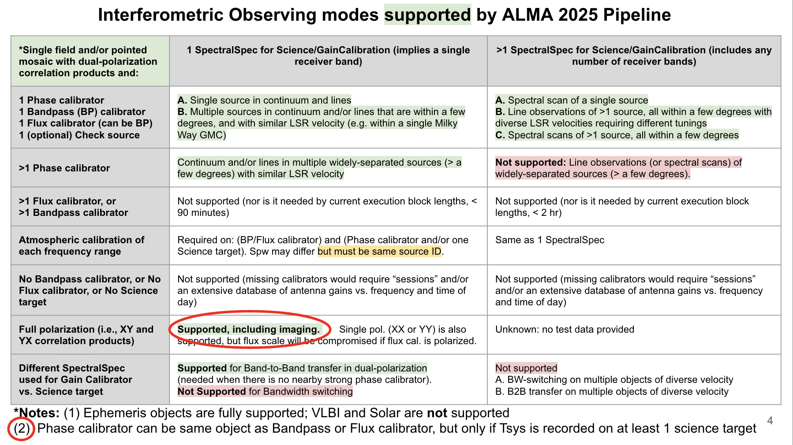
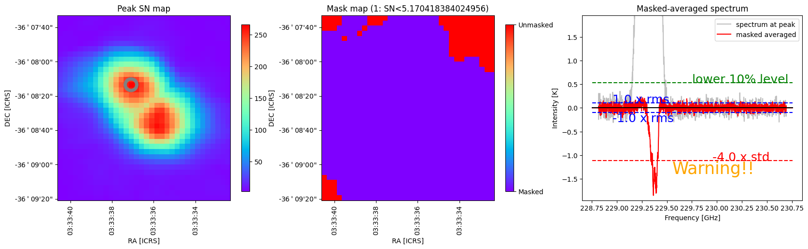

# What's New in 2025.1

## Major new capabilities

- The calibration of data with faint (low SNR) calibrator sources, which often includes high frequency, long baseline, and Band-to-band Interferometry cases, has been extended to handle more severe cases that previously failed to calibrate.
- Self-calibration has been extended to cover mosaic targets, and its heuristics for long baseline data have been improved.
- IQUV science target imaging capabilities have been introduced and added to the polarization recipes.
- The locations on the sky of atmospheric calibration scans are now correctly displayed on Spatial Setup page of the weblog.
- QA scores have been improved for {func}`hifa_bandpass <pipeline.hifa.cli.hifa_bandpass>` and the Amp/Ph-Freq component of {func}`hif_applycal <pipeline.hif.cli.hif_applycal>`.
- New QA have been developed in SDPL for calibrated amplitude vs time, and for residual emission in line-free channels of images.
- New plots of Jy/K as a function of time, and amplitude vs time have been added to SDPL.

## New features and improvements by WebLog section and processing stage

### General features

**Main overview (per-EB) pages:**
- ObservingMode is displayed per session (see {ref}`the WebLog Home Page example <fig-homepage>`)
- On the Spatial Setup Details page for mosaics, the Mosaic Pointings plot shows the location of the target Tsys "OFF" scans with a red dotted circle labeled with the scan number.
- On the Spectral Setup Details page, the spw name column as been added to the "All windows" tab.

**CASA log messages:**
- In {func}`hifa_importdata <pipeline.hifa.cli.hifa_importdata>`, default values have been defined for `FLUX_SERVICE_URL` and `FLUX_SERVICE_BACKUP`, which will be used when the corresponding environment variables are undefined: "Switching to default https://almascience.org/sc/flux" and "Switching to default https://asa.alma.cl.sc/flux".
- In {func}`hifa_importdata <pipeline.hifa.cli.hifa_importdata>`, a log message is written if the MOUS "contains EBs with mixed spw naming conventions. Spw names may not exactly match across EBs."
- In {func}`hifa_importdata <pipeline.hifa.cli.hifa_importdata>`, INFO messages have been added for "Calculating offset(s) for intent CALIBRATE_ATMOSPHERE#OFF_SOURCE" with subsequent lines indicating the "Median offset" in azimuth and elevation and the subsequent "Tsys Field radec" direction.

### New features and fixes specific to the interferometric pipeline

- **{func}`hifa_importdata <pipeline.hifa.cli.hifa_importdata>`** (<span style="color:red">see the `hifa_importdata` task description — Interferometric pipeline tasks section</span>):
  - A poor QA score results if the flux of any non-SSO amplitude calibrator (for any spw) is from the ASDM Source.xml file rather than a more recent Source Catalog query.

- **{func}`hifa_antpos <pipeline.hifa.cli.hifa_antpos>`** (<span style="color:red">see the `hifa_antpos` task description — Interferometric pipeline tasks section</span>):
  - Antenna positions are now queried from an online database rather than by supplying a CSV file with corrections to apply. The functionality to use a provided CSV file remains.

- **{func}`hifa_bandpass <pipeline.hifa.cli.hifa_bandpass>`** (<span style="color:red">see the `hifa_bandpass` task description — Interferometric pipeline tasks section</span>):
  - The low SNR heuristics now allow the "phase=up" pre-bandpass solution to combine spectral windows before increasing the solution interval in the process of improving solution SNR.
  - For FDM spectral windows and the baseline correlator (BLC), a new QA score evaluates whether the bandpass tables have evidence of sub-band issues.

- **{func}`hifa_spwphaseup <pipeline.hifa.cli.hifa_spwphaseup>`** (<span style="color:red">see the `hifa_spwphaseup` task description — Interferometric pipeline tasks section</span>):
  - Modifications were made to use `combine='spw'` for all INTENTS (except the Polarization calibrator) if required: In some cases, the BANDPASS, AMPLITUDE and/or DIFFGAIN (for Band-to-Band (B2B) data) may not be strong enough for a per-spw "int" timescale phase-up. If this is the case, spectral window combination can be triggered before also combining polarizations and extending the time solution interval.

- **{func}`hifa_diffgaincal <pipeline.hifa.cli.hifa_diffgaincal>`** (<span style="color:red">see the `hifa_diffgaincal` task description — Interferometric pipeline tasks section</span>):
  - Modifications were made as part of the low SNR heuristics to allow spectral window combination for all parts of the process, "reference", "B2B-offset", and "residual" solve processes if the sources are deemed too weak.

- **{func}`hif_applycal <pipeline.hif.cli.hif_applycal>`** (<span style="color:red">see the `hif_applycal` task description — Interferometric pipeline tasks section</span>):
  - The QA score that identifies amplitude-frequency or phase-frequency outliers no longer results in a fixed QA score of 0.9, but instead a score that gets lower based on how significant the outlier is, except for: amplitude-frequency offsets that are anomalously large but symmetric, or phase-frequency offsets for CHECK sources.

- **{func}`hif_checkproductsize <pipeline.hif.cli.hif_checkproductsize>`** (<span style="color:red">see the `hif_checkproductsize` task description — Interferometric pipeline tasks section</span>):
  - The stage was adapted to account for additional product size in IQUV full polarization imaging recipes.

- **{func}`hif_findcont <pipeline.hif.cli.hif_findcont>`** (<span style="color:red">see the `hif_findcont` task description — Interferometric pipeline tasks section</span>):
  - The moment difference SNR value is now displayed in the weblog table. Values less than about 10 generally mean minimal line contamination in the selected channel ranges.
  - The "AllCont" label has been added to the spectral plot.
  - When a cube of all zeros is encountered, it will proceed to the next cube.
  - Improvements to findContinuum.py:
    - Prevent erroneous AllCont status.
    - Prevent undefined variable error for jointMaskTmp.
    - Keep up with syntax changes in NumPy.
    - Fix deprecation warnings.

- **{func}`hif_makeimlist <pipeline.hif.cli.hif_makeimlist>`** (<span style="color:red">see the `hif_makeimlist` (cube) task description — Interferometric pipeline tasks section</span>):
  - Full polarization IQUV imaging has been added as a new capability. New stage variants are mfs_fullpol, cont_fullpol, cube_fullpol and cube_repBW_fullpol.

- **{func}`hif_makeimages <pipeline.hif.cli.hif_makeimages>`** (<span style="color:red">see the `hif_makeimages` (cube) task description — Interferometric pipeline tasks section</span>):
  - Spurious yellow warning messages in checksource imaging were fixed. (checksource {func}`hif_makeimages <pipeline.hif.cli.hif_makeimages>`)
  - Full polarization IQUV imaging has been added as a new capability (mfs, cont, cube, and repBW {func}`hif_makeimages <pipeline.hif.cli.hif_makeimages>` stages). New stage variants are mfs_fullpol, cont_fullpol, cube_fullpol and cube_repBW_fullpol.
  - Overlapping sky plot colorbar and labels were fixed (all {func}`hif_makeimages <pipeline.hif.cli.hif_makeimages>` stages).
  - Backend math was changed to calculate polarization intensity using sqrt(Q<sup>2</sup> + U<sup>2</sup>), with no V contribution (polarization calibrator {func}`hif_makeimages <pipeline.hif.cli.hif_makeimages>` stage).
  - Plot rendering issues were fixed for DSB receiver cases (cube {func}`hif_makeimages <pipeline.hif.cli.hif_makeimages>`).

- **{func}`hif_selfcal <pipeline.hif.cli.hif_selfcal>`** (<span style="color:red">see the `hif_selfcal` task description — Interferometric pipeline tasks section</span>):
  - New heuristics have been added to handle the self-calibration of ALMA mosaic data.
  - Solints that fail due to the beam-size growing by more than 5% will invoke a new fallback mode that attempts to pass through longer-baselines with flagged calibration solutions uncalibrated and unflagged to preserve the benefits of good solutions on shorter baselines.

- **{func}`hifa_exportdata <pipeline.hifa.cli.hifa_exportdata>`** (<span style="color:red">see the `hifa_exportdata` task description — Interferometric pipeline tasks section</span>):
  - The stage was adapted to account for additional products generated in IQUV full polarization imaging recipes.

- **AQUA report:**
  - Single-dish pipeline reports observed and theoretical rms as ObservedSensitivityJyPerBeam and TheoreticalSensitivityJyPerBeam in AQUA report.

    ```{admonition} Deprecation Warning
    :class: warning

    Both SD and IF now report ObservedSensitivityJyPerBeam and TheoreticalSensitivityJyPerBeam. In PL2026, the ambiguous and now redundant "SensitivityJyPerBeam" will be removed.
    ```
  - Sensitivity entries for IF tasks such as {func}`hif_makeimages <pipeline.hif.cli.hif_makeimages>` and {func}`hifa_imageprecheck <pipeline.hifa.cli.hifa_imageprecheck>` now use the correct XML tag.

### New features specific to the single-dish pipeline

- **{func}`hsd_flagdata <pipeline.hsd.cli.hsd_flagdata>`** (<span style="color:red">see the `hsd_flagdata` task description — Single Dish pipeline tasks section</span>):
  - A new function to flag outlier pointing data has been implemented. The correct map size is set, which prevents the pipeline from crashing. New QA scoring has been implemented accordingly.

- **{func}`hsd_skycal <pipeline.hsd.cli.hsd_skycal>`** (<span style="color:red">see the `hsd_skycal` task description — Single Dish pipeline tasks section</span>):
  - The plot of "elevation difference vs time" excludes flagged data, which caused an undesired scale of the display.
  - The plot of "time vs interval" has been removed.

- **{func}`hsd_k2jycal <pipeline.hsd.cli.hsd_k2jycal>`** (<span style="color:red">see the `hsd_k2jycal` task description — Single Dish pipeline tasks section</span>):
  - The plot of "summary of Jy/K conversion factor" has been improved. The new plot shows frequency (SPW ID) vs Jy/K conversion factor. A scatter plot appears in MSs with less than 5 EBs, and a box plot is created for MSs with 5 EBs or more.

- **{func}`hsd_applycal <pipeline.hsd.cli.hsd_applycal>`** (<span style="color:red">see the `hsd_applycal` task description — Single Dish pipeline tasks section</span>):
  - New QA scoring has been implemented to assess an amplitude difference between the two polarizations. A new diagnostic plot of "amplitude difference (XX-YY) vs frequency" has been implemented accordingly.
  - A new plot of "calibrated amplitude vs time" has been implemented to check the time variance of amplitude caused by unavoidable reasons (e.g., weather conditions, instrumental problems).

- **{func}`hsd_atmcor <pipeline.hsd.cli.hsd_atmcor>`** (<span style="color:red">see the `hsd_atmcor` task description — Single Dish pipeline tasks section</span>):
  - The latest atmospheric model has been applied.

- **{func}`hsd_baseline <pipeline.hsd.cli.hsd_baseline>`** (<span style="color:red">see the `hsd_baseline` task description — Single Dish pipeline tasks section</span>):
  - A new capability to set <span style="color:red">`fitfunc`</span> and <span style="color:red">`fitorder`</span> for each spectral window has been implemented.
  - New QA scoring has been implemented to remove unnecessary warnings. The QA messages have been updated accordingly.
  - Frequency reference frame (TOPO) has been added in the spectral figures.

- **{func}`hsd_imaging <pipeline.hsd.cli.hsd_imaging>`** (<span style="color:red">see the `hsd_imaging` task description — Single Dish pipeline tasks section</span>):
  - New QA scoring has been implemented to check for potential lines that have not been detected at the {func}`hsd_baseline <pipeline.hsd.cli.hsd_baseline>` stage. If potential lines are detected, a new diagnostic plot appears on this page.
  - QA scoring for a significantly small percentage of mask pixels has been improved. The warning messages have been updated accordingly.
  - Frequency reference frame (LSRK) has been added in the spectral figures.
  - Bugs in the calculation of Theoretical RMS have been fixed.

## Current Known Limitations of the 2025 Pipeline

(none of these are new for 2025)

### General limitations

- All raw data (ASDMs) run through the pipeline must have complete and properly formatted binary and metadata. This is not always the case for ASDMs from earlier ALMA cycles. In particular:
  - The SD pipeline can only be run on data from Cycle 3 or later.
  - The IF pipeline will not work with ALMA Cycle 0 data, nor with some Cycle 1 – 2 data (those that do not have complete and accurate calibration intent labelling).

  Manually calibrated data from Cycles 1 – 3 are likely to have problems if run through the pipeline.

- The representative source name must be observed at least once with TARGET intent in the representative spectral window name. A corollary statement is that the representative spectral window cannot be used to observe only calibration intents.

- The raw data (ASDMs) run through the pipeline should have a "quality assurance level 0" (QA0) assessment of "QA0 Pass". Running the pipeline on non-quality assured data ("QA0 SemiPass" or "QA0 Fail") is not expected to give sound results and may fail.

- In general, CASA assumes that it has access to all of the available RAM on the node where it is run. If other processes use significant amounts of this RAM, the pipeline may fail. For example, if running with a resource allocator such as Torque or slurm, part of the CASA {func}`CASA/tclean <casatasks.imaging.tclean>` task (major cycle gridding) will respect CGROUP memory limits, but other parts of CASA will not. Please contact the pipeline working group (PLWG) via the [ALMA Helpdesk](https://help.almascience.org/) for advice on pipeline usage in complex computing environments.

(fig-obsmodes)=
**Summary of supported observing modes in PL2025**



### Additional limitations of the Interferometric Pipeline

(sec-obsmodes)=
The IF pipeline is commissioned only for the observing modes shown in {ref}`the figure above <fig-obsmodes>`, subject to these additional restrictions:

- While the IF pipeline calibration and flagging tasks do include low signal-to-noise ratio (SNR) heuristics, which have been further improved in PL2025, it remains the case that the calibration recipe will produce poor results if the calibrators are too weak. If the sources are so weak that solutions cannot be found, including on check sources, then the pipeline will crash, first in {func}`hifa_gfluxscale <pipeline.hifa.cli.hifa_gfluxscale>`.

- In order to increase delivery rates of data to PIs, the archived imaging products may be binned in frequency, limited in the imaged field of view (for single field cases), and/or restricted to a subset of sources (<span style="color:red">see the mitigation section — Interferometric pipeline tasks section</span>). Users can generate the missing products by making small modifications to the scripts that are archived with the data.

- The frequency ranges for interferometric continuum identification and subtraction are determined in an automated manner that works well over a very broad range of observing modes and source properties. In some cases (e.g. hot core line emission, noisy broadband continuum), it is expected that better results can sometimes be obtained by more careful examination of individual sources and/or spectral windows. If the data are heavily binned in frequency either by the online system, or before this task is run, the results may be compromised. The user can edit the file `cont.dat` ({ref}`cont.dat (IF imaging pipeline) <sec-cont-dat>`) and rerun sections of the imaging pipeline to obtain their own continuum subtracted visibilities and new line images.

- The IF PL imaging steps use the "effective channel bandwidth" from the raw data (the SpectralWindow.xml file of the ASDM) to calculate the theoretical image sensitivity and hence the cleaning thresholds. This information was not correctly stored in raw ALMA data in Cycles 2 and earlier; as a result, the cleaning thresholds will be higher than intended when such data is run through the imaging pipeline (results will still be correct, merely not as deeply cleaned).

- The standard recipes used in operations in 2025 include self-calibration for single-field and mosaicked non-ephemeris targets, but there are still cases for which pipeline imaging products of bright sources can be dynamic range limited: bright mosaics and ephemeris sources, bright sources for which the self-calibration doesn't converge and thus is not applied, or if the {func}`hif_selfcal <pipeline.hif.cli.hif_selfcal>` stage is removed from the recipe by a data reducer.

- The interferometric imaging pipeline commands should work with MeasurementSets calibrated outside the pipeline, but this usage has not been tested extensively and may have as-yet undetermined failure modes.

### Additional limitations of the Single-dish Pipeline

- The frequency ranges for single dish line identification and spectral baseline subtraction are done in an automated manner that has been most optimized to detect moderate channel width emission lines at the center of a spectral window. It is, however, expected that better results can be obtained by more careful examination of individual sources and/or spectral windows. The following cases are most notably affected:
  - Very broad emission lines that potentially occupies a full spw, both in FDM and TDM modes.
  - Cubes with a "forest" of emission lines.

- The SD pipeline imaging results may be unusable if there is emission in the "off" position and/or if the atmospheric line features still remain in the calibrated data. However, as described below diagnostic plots aide in clearly identifying this situation. The example below shows the "contamination plot" for the case the OFF position is contaminated by the astronomical signal.

  (fig-examplecontamination)=
  **Example contamination plot**

  

- When strong emission is flagged in {func}`hsd_blflag <pipeline.hsd.cli.hsd_blflag>` due to unidentified line channels, this can increase the RMS at the corresponding spws. In operation, this issue can be resolved by manually redefining the line ranges in the corresponding spws and reprocess the data. However, in few extreme cases (e.g. Solar system objects observation), altering line ranges is not enough to resolve the issue. This issue can be circumvented by turning off the corresponding {func}`hsd_blflag <pipeline.hsd.cli.hsd_blflag>` flagging heuristics. If a user faces at situations shown above, we recommend to contact the [ALMA Helpdesk](https://help.almascience.org/) for detailed advice.

A list of pipeline "known issues" that arise after the publication date of this document is maintained on the ALMA Science Portal at <http://almascience.org/processing/>. This list will be updated as issues are discovered during the cycle, including back dating the scope of new issues to prior cycles.
